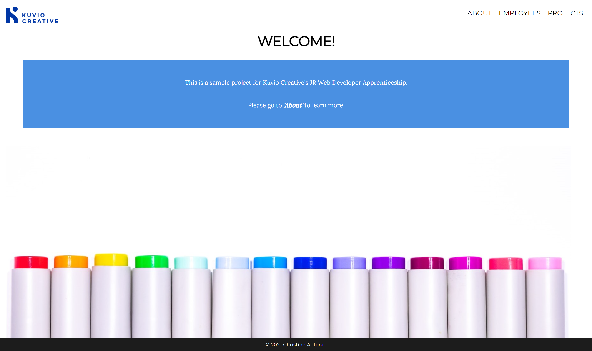
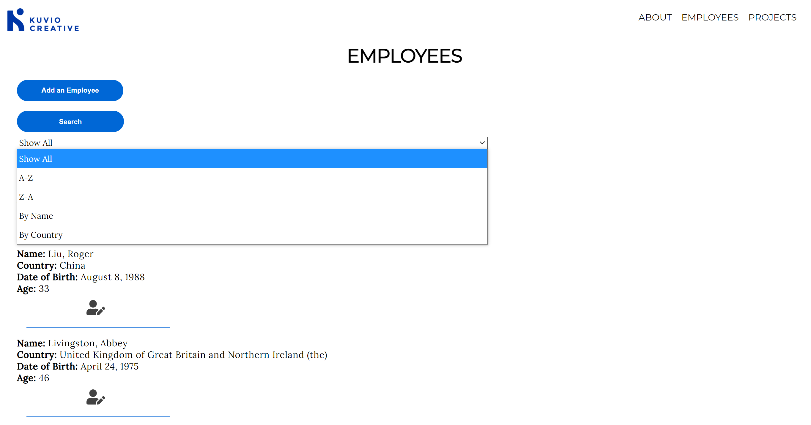
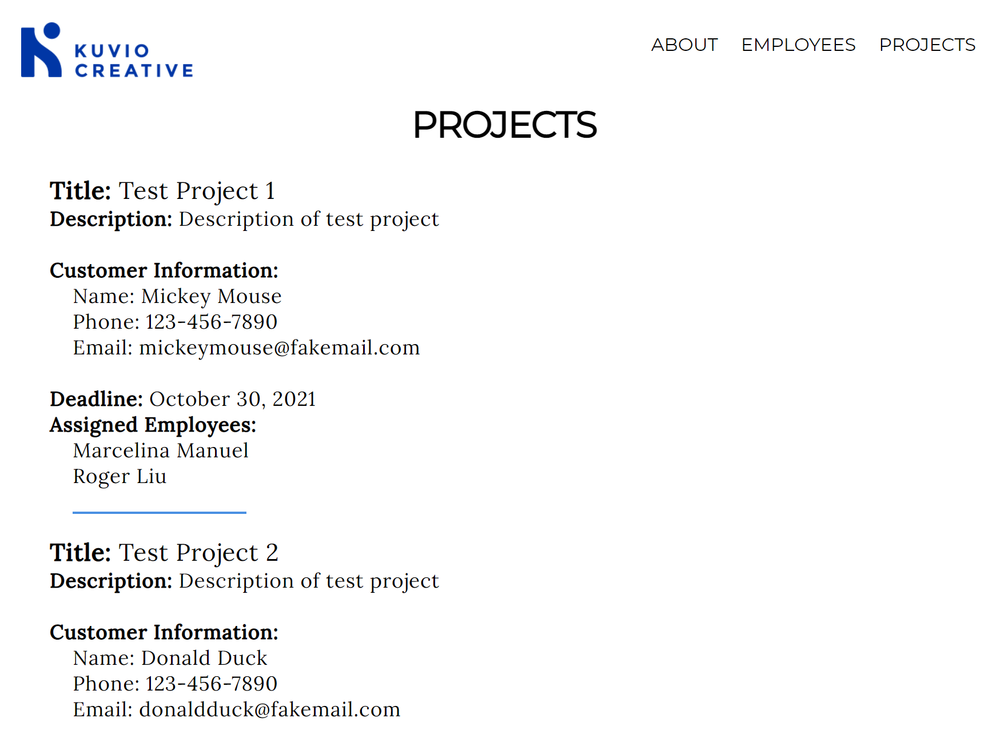

# Kuvio Sample Project

## About the App

This app is a sample project for the Kuvio Creative JR Developer Apprenticeship.

---

## Features

### Employee Directory

- Displays a list of employees
- Search for employees (alphabetically, by name, by country)
- Add new employees
- Edit current employee information
- Database stores employee information, including Employee id, First name, Last name, Country, Date of birth, and Age

### Projects

- Displays a list of projects including Title, Description, Customer information, Deadline, and Assigned Employees
- Database stores information for customers, projects, and project assignments in respective tables

---

## [API Documentation](https://kuvio-api.herokuapp.com/api)

### Endpoints

#### /employees

- GET: returns all employees
- POST: add an employee

#### /employees/:emp_id

- GET: return a specified employee
- PATCH: update information for a specified employee
- DELETE: delete a specified employee

#### /customers

- GET: returns all customers
- POST: add a customer

#### /customers/:customer_id

- GET: return a specified customer
- PATCH: update information for a specified customer
- DELETE: delete a specified customer

#### /projects

- GET: returns all projects
- POST: add a project

#### /projects/:project_id

- GET: return a specified project
- PATCH: update information for a specified project
- DELETE: delete a specified project

#### /assignments

- GET: returns all project assignments
- POST: add a project assignment

#### /assignments/:assignment_id

- GET: return a specified project assignment
- PATCH: update information for a specified project assignment
- DELETE: delete a specified project assignment

---

### Technology

- HTML
- CSS
- JavaScript
- ReactJS
- NodeJS
- Express
- PostgreSQL
- Vercel
- Heroku

---

### Pending Features

#### Error Boundary

- Ideally, error boundaries would have been implemented throughout the app to inform the user of any UI or server errors; however due to time constraints, this was not included.

#### ADD / EDIT / DELETE customers, projects, and project assignments

- The API has been developed to respond to these endpoints, but features have not yet been implemented on the client-side.

#### Complete testing of all components and endpoints

- Due to time contraints, this app has not been fully tested
